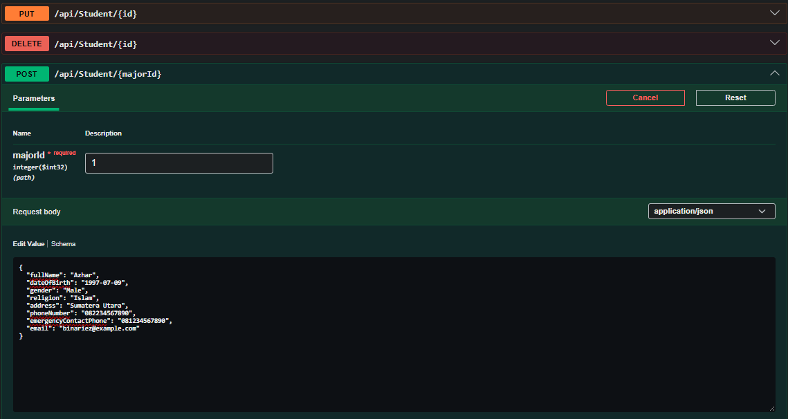

# 🎓 College Academic Information System API

A RESTful API for managing academic college data. This project is currently work in progress.
Current endpoints are: **Majors**, **Students**, and **Courses**.
Built using **ASP.NET Core Web API** with an **MVC Controller + Layered Architecture** approach.

---

## 🚀 Current Features

* CRUD Operations for Majors
* CRUD Operations for Students
* CRUD Operations for Courses
* Relationships:
  * Major → Students (One-to-Many)
  * Major → Courses (One-to-Many)
* DTO Pattern (Request & Response)
* Layered Architecture (Controller → Service → Repository)
* Entity Framework Core (ORM)

---
```text
In order to add either new student or course, we have to firstly add at least 1 major data.
This is because both entities are tied with major entity by 1 to many relation.
```

---

## 🏗️ Architecture

```text
Controller → Service → Repository → Database
```

---

## 📂 Project Structure

```text
├── Controllers/
│
├── Services/
│   ├── Interfaces/
│   └── <Implementations>
│
├── Repositories/
│   ├── Interfaces/
│   └── <Implementations>
│
├── Models/
│
├── Mappers/
│
├── DTOs/
│   ├── Student/
│   ├── ProgramStudy/
│   └── Course/
│
├── Persistence/
│   └── AppDbContext.cs
│
├── Shared/
│   └── Enums/
```
---

## 📡 API Endpoints

### Student

* `GET /api/student`
* `GET /api/student/{id}`
* `POST /api/student/{majorId}`
* `PUT /api/student/{id}`
* `DELETE /api/student/{id}`

### Major

* `GET /api/major`
* `GET /api/major/{id}`
* `POST /api/major`
* `PUT /api/major/{id}`
* `DELETE /api/major/{id}`

### Course

* `GET /api/course`
* `GET /api/course/{id}`
* `POST /api/course/{majorId}`
* `PUT /api/course/{id}`
* `DELETE /api/course/{id}`

---

## 📸 API Documentation (Swagger)

### 🔹 Swagger UI Request Example



---

### 📦 JSON Response Example

```json
{
  "id": 1,
  "fullName": "Azhar",
  "dateOfBirth": "1997-07-09",
  "gender": "Male",
  "religion": "Islam",
  "address": "Sumatera Utara",
  "phoneNumber": "082234567890",
  "emergencyContactPhone": "081234567890",
  "email": "binariez@example.com",
  "majorid": 1
}
```

---

## 🔧 Tech Stack

* ASP.NET Core Web API
* Entity Framework Core
* SQL Server
* C#

---

## ⚙️ Setup

```bash
git clone https://github.com/binariez/college-academic-api.git

cd college-academic-api/College.Api

dotnet ef database update

dotnet run --launch-profile https
```

---

## 🔮 Currently Planned Improvements

* Many-to-many relationship between course and major and future entities
* Student's personal taken course list
* Enrollment (KRS)
* Grading bussiness logic (IPK, KHS etc.)
* Authentication & Authorization
* Pagination & Filtering
* Refactor to Clean Architecture

---

## 👨‍💻 Author

binariez (Azhar)

---

## 📄 License

This project is open-source and available under the MIT License.
